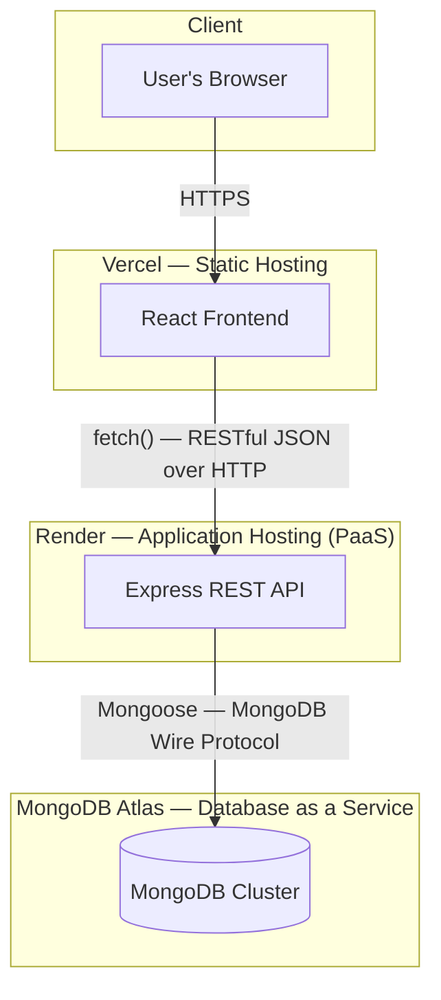

# Cloud Architecture

## Overview

Issue Tracker follows a **three-tier architecture**, with each tier deployed independently on its own specialized cloud platform:

## Why three separate cloud services

Rather than hosting everything on a single server, each layer runs on a platform specialized for that job:

- **MongoDB Atlas** — a fully managed Database-as-a-Service. Atlas handles hosting, backups, and availability for the database, so the application never needs to manage a physical or virtual database server.
- **Render** — a Platform-as-a-Service for running the backend continuously. Render builds the Express app from source and keeps it running, exposing it at a public HTTPS URL.
- **Vercel** — a static hosting / PaaS platform for the frontend. Vercel builds the React app into static assets and serves them from a global CDN.

This separation means each layer can be redeployed, scaled, or replaced independently without affecting the others, and each platform only needs to do the one job it's optimized for.

## Communication layers

There are two distinct types of communication in this system, using two different protocols:

1. **Frontend ↔ Backend** — a RESTful API over HTTP(S). URLs represent resources (`/issues`), and HTTP methods (GET/POST/PUT/DELETE) represent actions. Every response includes a status code communicating the outcome (200, 201, 400, 404, 500).

2. **Backend ↔ Database** — Mongoose, an Object Data Modeling library, communicates with MongoDB using MongoDB's own wire protocol. This is **not** a REST API — REST is specific to HTTP-based communication, whereas this is a database driver protocol.

## Request lifecycle example: updating an issue's status

1. User selects a new status in the browser (React frontend, on Vercel)
2. React sends `PUT https://issue-tracker-payr.onrender.com/issues/:id` with `{ "status": "Closed" }` as the JSON body
3. The request travels over the internet to Render, where the Express server is running
4. Express middleware runs (`cors()`, `express.json()`), then routes the request to the matching handler
5. The handler calls `Issue.findByIdAndUpdate(...)`, which Mongoose translates into a MongoDB command
6. Mongoose sends this to MongoDB Atlas over the internet
7. Atlas updates the document and returns the result
8. Express responds to the frontend with the updated issue and a `200` status
9. React updates its state, and the UI re-renders to reflect the change — no page reload

## Security

- Database credentials are stored as environment variables on Render (`MONGODB_URI`), never committed to source control (`.env` is `.gitignore`d).
- The frontend's backend URL (`VITE_API_URL`) is stored as an environment variable on Vercel — not a secret, but kept configurable rather than hardcoded.
- MongoDB Atlas Network Access is configured to accept connections from any IP (`0.0.0.0/0`), since Render does not expose a fixed, whitelistable IP address. Access control is enforced through the database's authenticated username/password instead.
- CORS is enabled on the backend to explicitly allow the deployed frontend's origin to make requests to the API.

## Environments

| Environment | Frontend URL | Backend URL |
|---|---|---|
| Production | https://issue-tracker-roan.vercel.app/ | https://issue-tracker-payr.onrender.com |
| Local development | http://localhost:5173 | http://localhost:5000 |

Both frontend and backend redeploy automatically on every push to the `main` branch on GitHub, via each platform's continuous deployment integration.
