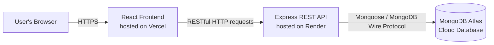

# Issue Tracker

A full-stack CRUD web application for creating, tracking, and managing issues (bugs/tasks), built to demonstrate a practical cloud computing architecture using independently hosted, specialized cloud services.

**Live App:** https://issue-tracker-roan.vercel.app/
**Live API:** https://issue-tracker-payr.onrender.com/issues

---

## Overview

Issue Tracker lets a user create issues with a title, description, priority, and status, then view, search, filter, sort, update, and delete them — all persisted in a cloud-hosted database and served through a RESTful API.

The project deliberately keeps the data model simple (a single `Issue` entity) so that effort and evaluation can focus on the cloud architecture, REST API design, and deployment pipeline rather than complex business logic.

## Features

- Create, read, update, and delete issues
- Search issues by title
- Filter issues by status (Open / In Progress / Closed)
- Sort issues by newest, oldest, or priority
- Live dashboard stats (total, open, in progress, closed counts)
- Light / dark mode
- Responsive dashboard-style UI

## Tech Stack & Cloud Services

| Layer | Technology | Hosted On |
|---|---|---|
| Frontend | React (Vite) | Vercel |
| Backend / API | Node.js, Express | Render |
| Database | MongoDB (via Mongoose) | MongoDB Atlas |

Each layer is deployed independently on a specialized managed cloud platform (a Database-as-a-Service and two Platform-as-a-Service providers), communicating entirely over the internet via HTTPS.

## Architecture



See [ARCHITECTURE.md](./ARCHITECTURE.md) for a detailed explanation of each layer and the request lifecycle.

## API

See [API_DOCUMENTATION.md](./API_DOCUMENTATION.md) for the full list of endpoints, request/response formats, and status codes.

## Database Schema

See [DATABASE_SCHEMA.md](./DATABASE_SCHEMA.md) for the `Issue` model's fields, types, and validation rules.

## Project Structure

```
issue-tracker/
├── backend/          # Express REST API
│   ├── models/
│   │   └── Issue.js  # Mongoose schema
│   └── server.js     # Server entry point, routes, middleware
├── frontend/         # React (Vite) client
│   └── src/
│       ├── App.jsx
│       ├── Sidebar.jsx
│       ├── StatsBar.jsx
│       ├── IssueForm.jsx
│       └── IssueCard.jsx
├── ARCHITECTURE.md
├── API_DOCUMENTATION.md
├── DATABASE_SCHEMA.md
└── README.md
```

## Running Locally

### Backend

```bash
cd backend
npm install
```

Create a `.env` file inside `backend/`:
```
MONGODB_URI=your_mongodb_connection_string
```

```bash
npm run dev
```
Runs on `http://localhost:5000`.

### Frontend

```bash
cd frontend
npm install
```

Create a `.env` file inside `frontend/`:
```
VITE_API_URL=http://localhost:5000
```

```bash
npm run dev
```
Runs on `http://localhost:5173`.

## Deployment

- **Backend (Render):** Root directory `backend`, build command `npm install`, start command `node server.js`, with `MONGODB_URI` set as an environment variable.
- **Frontend (Vercel):** Root directory `frontend`, framework preset Vite, with `VITE_API_URL` set as an environment variable pointing to the live Render backend URL.

Both platforms redeploy automatically on every push to the `main` branch.
